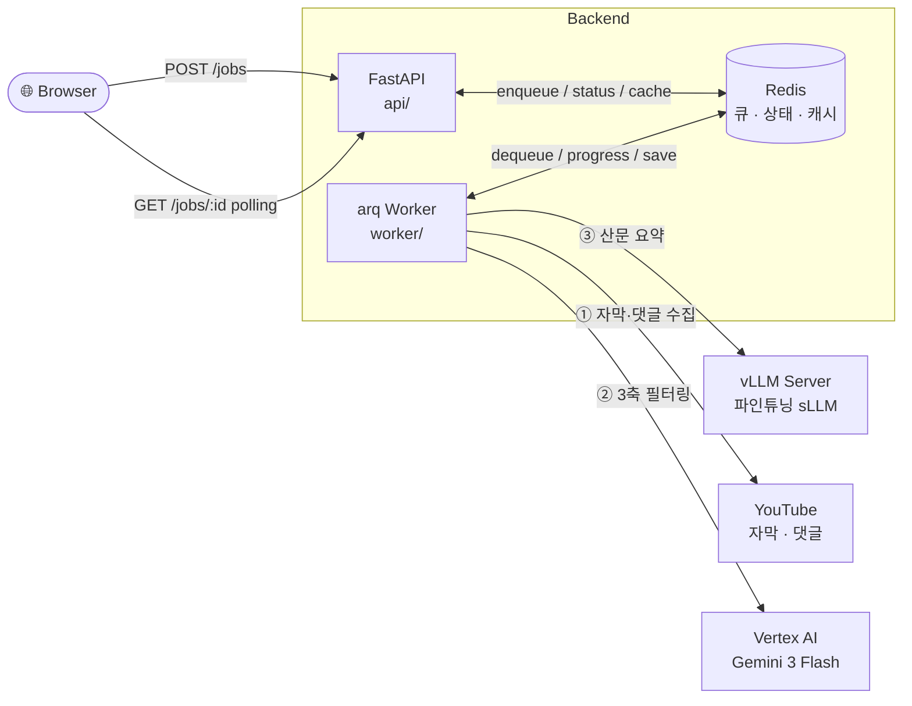

# Hi-VideoSum Web Service

YouTube URL → 자막·댓글 수집 → Gemini 3축 필터링 → vLLM(파인튜닝 sLLM) 산문 요약을 한 번에 처리하는 비동기 웹서비스.

## 구성

```
web_service/
├── api/            FastAPI: POST /jobs, GET /jobs/{id}, GET /jobs/{id}/result
├── worker/         arq 워커: collect → filter → summarize
│   └── steps/      각 단계 어댑터
├── inference/      vLLM serve.sh + 프롬프트(filter, summary) + LoRA 어댑터 경로
├── shared/         URL 파싱, 로깅 등 공통 유틸
├── configs/        filter_gemini.yaml
├── frontend/       단순 HTML 폼 (선택)
└── tests/
```

## 작동 방식

### 전체 컴포넌트 구성

요약 1건은 약 1~2분이 걸리므로 **FastAPI는 접수·조회만 즉시 처리**하고, 실제 파이프라인은 **arq 워커**가 백그라운드로 수행한다. 둘은 직접 통신하지 않고 **Redis**를 우편함으로 사용한다.



| 컴포넌트 | 역할 | 실행 명령 |
|---|---|---|
| FastAPI | HTTP 요청 접수·상태 조회·결과 반환 (실제 작업은 안 함) | `uvicorn api.main:app` |
| arq Worker | 큐에서 잡을 꺼내 3단계 파이프라인 실행 | `arq worker.runner.WorkerSettings` |
| Redis | 잡 큐 + 진행 상태 hash + 결과·캐시 string | `redis-server` 또는 도커 컨테이너 |
| vLLM | 파인튜닝된 LoRA 어댑터로 산문 요약 생성 | `bash inference/serve.sh` |
| Vertex AI Gemini | 댓글 3축(정보성·의견성·연관성) 평가 | 외부 API (gcloud ADC 또는 SA JSON) |

### Redis 키 구조

| 키 | 타입 | 용도 |
|---|---|---|
| `arq:queue` | list | arq가 자동으로 관리하는 잡 큐 |
| `job:{job_id}:meta` | hash | `status`, `progress`, `error` (polling 대상) |
| `job:{job_id}:result` | string(JSON) | 최종 요약 결과 |
| `cache:video:{video_id}` | string | video_id → job_id (캐시 인덱스) |

`meta` · `result` · `cache:video:*` 모두 TTL 24시간 (`RESULT_TTL_SECONDS`).

### 단계별 처리 시간 (참고)

| 단계 | 추정 | 변수 |
|---|---|---|
| Collect | 10–60초 | 영상 길이, 댓글 수, 프록시 사용 여부 |
| Filter (Gemini Flash) | 10–30초 | 댓글 수, thinking_level |
| Summarize (vLLM) | 10–30초 | 시퀀스 길이, 출력 토큰 수 |
| **합계** | **30–120초** | 캐시 hit이면 0초 |

## 사전 준비

1. `.env` 작성 (`.env.example` 참고)
   - `WEBSHARE_PROXY_USERNAME/PASSWORD` (대규모 수집 시)
   - `GCP_PROJECT`, `GCP_LOCATION` (Vertex AI Gemini)
   - `VLLM_BASE_URL`, `VLLM_MODEL_NAME` (LoRA 어댑터 이름)
2. Vertex AI 인증
   - 로컬: `gcloud auth application-default login`
   - 도커/운영: 서비스 계정 JSON을 `.env`의 `GOOGLE_SA_PATH`에 지정
3. 파인튜닝 LoRA 어댑터를 `inference/adapters/hivideosum/`에 배치
   (`adapter_config.json` + `adapter_model.safetensors`)

## 로컬 실행 (개발)

```bash
cd web_service
pip install -r requirements.txt

# 1) vLLM 별도 터미널
bash inference/serve.sh

# 2) Redis
docker run -d --name hi-redis -p 6379:6379 redis:7-alpine

# 3) 워커
arq worker.runner.WorkerSettings

# 4) API
uvicorn api.main:app --reload --host 0.0.0.0 --port 8000
```

UI: <http://localhost:8000/ui/>
API: <http://localhost:8000/docs>

## docker-compose 실행

### 1. Docker + NVIDIA Container Toolkit 설치

```bash
# Docker 설치
curl -fsSL https://get.docker.com | sh
sudo usermod -aG docker $USER

# NVIDIA Container Toolkit 설치
curl -fsSL https://nvidia.github.io/libnvidia-container/gpgkey \
  | sudo gpg --dearmor -o /usr/share/keyrings/nvidia-container-toolkit-keyring.gpg
curl -s -L https://nvidia.github.io/libnvidia-container/stable/deb/nvidia-container-toolkit.list \
  | sed 's#deb https://#deb [signed-by=/usr/share/keyrings/nvidia-container-toolkit-keyring.gpg] https://#g' \
  | sudo tee /etc/apt/sources.list.d/nvidia-container-toolkit.list
sudo apt update && sudo apt install -y nvidia-container-toolkit
sudo nvidia-ctk runtime configure --runtime=docker
sudo systemctl restart docker
```

### 2. .env 작성

```bash
cp .env.example .env
```

`.env`에서 채워야 할 항목:

| 항목 | 설명 |
|---|---|
| `GOOGLE_SA_PATH` | GCP 서비스 계정 JSON 경로 (아래 참고) |
| `HUGGING_FACE_HUB_TOKEN` | HuggingFace 토큰 (Gemma 모델 접근용) |
| `WEBSHARE_PROXY_USERNAME/PASSWORD` | (선택) 대규모 수집 시 프록시 |

**Vertex AI 인증 방법 (서비스 계정 키 생성이 막혀 있는 경우)**

조직 정책으로 서비스 계정 JSON 발급이 불가할 때는 gcloud ADC 자격증명을 마운트한다.

```bash
# gcloud CLI 설치
curl https://sdk.cloud.google.com | bash
exec -l $SHELL

# 인증
gcloud auth application-default login
```

로그인 후 생성된 파일을 `.env`에 지정:
```
GOOGLE_SA_PATH=/home/$USER/.config/gcloud/application_default_credentials.json
```

**HuggingFace 토큰**

`google/gemma-4-E4B-it`은 gated 모델이므로 라이선스 동의 후 토큰이 필요하다.
[huggingface.co/settings/tokens](https://huggingface.co/settings/tokens)에서 발급 후 `.env`에 추가:
```
HUGGING_FACE_HUB_TOKEN=hf_xxxx
```

### 3. 실행

```bash
sudo docker compose up --build
```

처음 실행 시 vLLM 이미지(수 GB)와 Gemma 모델을 다운로드하므로 시간이 걸린다.

UI: <http://localhost:8000/ui/>
API: <http://localhost:8000/docs>

### 주의사항

- 시스템에 Redis가 이미 실행 중이면 포트 6379 충돌이 발생한다: `sudo systemctl stop redis-server`
- 재시작 시 기존 컨테이너를 먼저 정리: `sudo docker compose down`

## API 스펙

```
POST /jobs                     { "url": "..." }
  202 → { "job_id", "cached": false }
  200 → { "job_id", "cached": true, "result": {...} }   # 캐시 hit

GET  /jobs/{job_id}            { "status", "progress", "error" }
GET  /jobs/{job_id}/result     SummaryResult (3문단 + filter_stats)
GET  /health                   { "status": "ok" }
```

`status`: `queued | collecting | filtering | summarizing | done | failed`

## 기존 코드와의 연결

- `worker/steps/collect.py` → `worker/collectors/youtube_collector.collect_video_data` (자막·댓글 수집기를 프로젝트 내부에 포함)
- `inference/prompts/filter_prompt.py` → `filter_comments_with_gemini.py`의 3축 프롬프트 + 파이프 응답 파서를 함수화
- `inference/prompts/summary_prompt.py` → `summarize_with_gemini.py`의 3문단 산문 프롬프트와 헬퍼 4종

## 테스트

```bash
pytest tests/
```

네트워크·LLM 호출 없는 프롬프트/파서 단위 테스트만 포함되어 있음. e2e 검증은 짧은 영상 1개로 직접 호출하여 확인.
